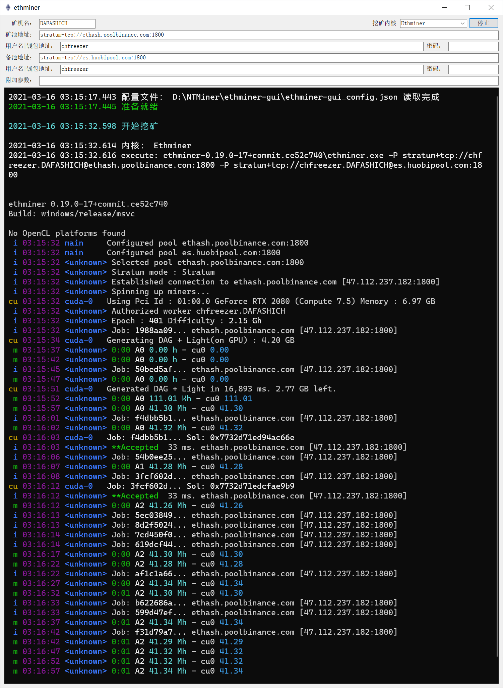

# ethminer-gui
GUI for Ethminer

## 说明
* 自用简单的挖矿GUI程序，0抽水
* 挖矿时可最小化至系统托盘，防止手贱误关
* 支持 [Ethminer](https://github.com/ethereum-mining/ethminer)（抽水0%），[Phoenix Miner](https://phoenixminer.org/)（抽水0.65%），[NBMiner](https://github.com/NebuTech/NBMiner)（抽水1%）
* 内嵌Windows Terminal控制台
* Windows Terminal与指定的挖矿内核可自由升级至最新版本

## 矿池地址填写
* Ethminer 对于大多数矿池，需要加前缀stratum1+tcp://
* PhoenixMiner 对于大多数矿池不需要加任何前缀
* NBMiner 对于大多数矿池，需要加前缀ethproxy+tcp://

参考：

https://github.com/ethereum-mining/ethminer/blob/master/docs/POOL_EXAMPLES_ETH.md#servers
https://phoenixminer.org/documentation/quick-start/#ethash-mining-command-line-examples
https://github.com/NebuTech/NBMiner/blob/master/readme_zh.md#%E4%BD%BF%E7%94%A8%E6%A0%B7%E4%BE%8B

## 关于杀毒软件
挖矿内核报毒属于正常现象，如果你不放心，可以自己去挖矿内核官网下载对应内核的最新版本
